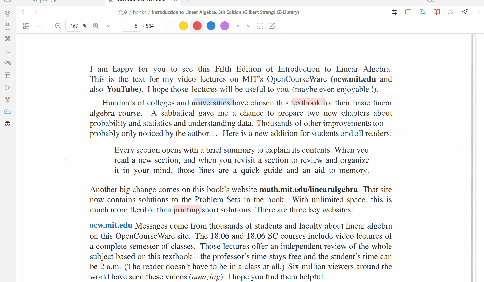
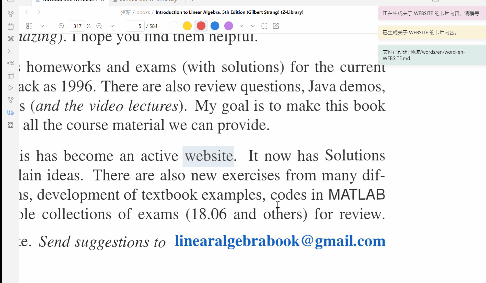

# WordCards for Obsidian
english  [中文](./others/README-ZH.md)  [日本語](./others/README-JP.md)

**WordCards** is a plugin designed for Obsidian, aiming to enhance your vocabulary learning, language studies, and note-taking experience by directly generating detailed flashcards. Leveraging OpenAI's API and Imgur's API, WordCards efficiently creates comprehensive word entries, helping you easily manage and expand your vocabulary.

## Multilingual Support: Create personalized language flashcards from any language you want to learn.


## Generate Flashcards from PDF++ (Bidirectional Links)


## Generate Cards from Screenshots (Add Image Links at the End)


## Features

- **Automatic Flashcard Creation**: Generate detailed flashcards from text or image content in the clipboard.
- **Customizable Prompts**: Customize the flashcard templates according to your needs.
- **Flexible Opening Modes**: Choose different locations within the Obsidian workspace to open newly created flashcards (left pane, right pane, new window, etc.).
- **Image Support**: Upload images to Imgur and include them in flashcards.
- **Seamless Integration**: Easily integrate into your existing Obsidian workflow via toolbar icons and commands.
- **Settings Panel**: Comprehensive settings options for configuring language, API keys, folder paths, and card behaviors.

## Table of Contents

- [Installation](#installation)
- [Configuration](#configuration)
- [Usage](#usage)
- [Detailed Settings](#detailed-settings)
- [Contributing](#contributing)
- [License](#license)

## Installation

### Install via Obsidian Community Plugins

1. **Open Obsidian**.
2. Go to `Settings` > `Community Plugins`.
3. Ensure that `Safe Mode` is **turned off**.
4. Click `Browse`, search for `WordCards`.
5. Click `Install`, then click `Enable`.

### Manual Installation

1. **Download the Plugin**:
   - Clone or download the plugin from the [GitHub repository](https://github.com/bwicarus/Obsidian-WordCards.git).
2. **Copy the Plugin Folder**:
   - Copy the plugin folder (`WordCards`) to your Obsidian Vault's plugin directory: `.obsidian/plugins/`.
3. **Restart Obsidian or Reload Plugins**.
4. **Enable the Plugin**:
   - Go to `Settings` > `Community Plugins`, find `WordCards`, and enable it.

## Configuration

Before using WordCards, you need to set up your API keys and other configuration options.

### Required API Keys

1. **OpenAI API Key**:
   - Visit [OpenAI](https://platform.openai.com/) to register or log in.
   - Navigate to the API section and generate a new API key.
   - Keep this key secure and do not share it publicly.

2. **Imgur Client ID**:
   - Register an application at [Imgur](https://api.imgur.com/oauth2/addclient).
   - Choose the appropriate application type and obtain your `Client ID`.

### Setup Steps

1. **Open Obsidian Settings**:
   - Go to `Settings` > `Plugin Options` > `WordCards`.
2. **Configure Language**:
   - **Source Language**: Select the language of the words you input (e.g., English, Japanese).
   - **Target Language**: Select the translation language for the flashcards (e.g., Chinese, French).
3. **Set Target Folder Path**:
   - Specify the relative path in your Vault where the flashcards will be saved (e.g., `Library/English/words`).
4. **Enter API Keys**:
   - **OpenAI API Key**: Paste your OpenAI API key.
   - **Client ID**: Paste your Imgur Client ID.
5. **Choose Opening Mode**:
   - Select where the newly created flashcard will open within the Obsidian workspace:
     - `left`: Left pane.
     - `right`: Right pane.
     - `window`: New window.
     - `active`: Active pane.
     - `tab`: New tab.
     - `none`: Do not open automatically.
6. **Toggle Setting Options**:
   - **Set as Active**: Choose whether to set the created flashcard as the active pane after creation.
   - **Allow Overlapping Cards**: Decide whether new cards can overwrite existing ones or create new entries.
7. **Customize Prompts**:
   - Modify the GPT prompts to customize the information included in the flashcards.

### Additional Settings
If you want to generate beautiful links in PDF++ and display highlights in PDFs, configure the following sections in PDF++:


```
{{text}}
```

```
>[!{{calloutType}}|{{color}}]
>
>{{linkWithDisplay}}
```

## Usage

### Creating Flashcards

#### Via Toolbar Icon

1. Select a string of text or take a screenshot.
2. Click the **WordCards icon** in the Obsidian toolbar to generate a new flashcard from the clipboard content.

#### Via Command Palette

1. Select text or take a screenshot.
2. Press `Ctrl+P` (or `Cmd+P` on macOS) to open the command palette.
3. Search for `Get clipboard content, query GPT, and create a new note` and execute the command.

#### Using the Commander Plugin
[[Plugin Link]](https://github.com/phibr0/obsidian-commander)

This plugin allows you to use commands in various ways and even combine multiple commands easily.

You can even configure it to create flashcards with a single click in PDF++ (yes, I'm that lazy).


Add a command to copy links from PDF++, then add a short delay followed by our flashcard command.

Once this command is created, you can place it anywhere using the Commander plugin.

### Workflow Scenarios

- **Clipboard Contains Text**:
  - If the clipboard contains word text, activating WordCards will create a flashcard with detailed information such as translations, definitions, and example sentences based on the configured prompts.

- **Clipboard Contains Image**:
  - If the clipboard contains an image, WordCards will upload the image to Imgur, use GPT-4 to analyze the image content, and create a flashcard containing the extracted information and the image.

- **Processing Active File**:
  - Depending on the type of the current active file (e.g., Markdown or PDF), WordCards will handle the content accordingly, creating new flashcards or appending to existing ones.

## Detailed Settings

You can access the settings panel by going to `Settings` > `Plugin Options` > `WordCards`. Below is a detailed explanation of the available settings:

- **Source Language**:
  - Dropdown menu to select the language of the input words.

- **Target Language**:
  - Dropdown menu to select the translation language for the flashcards.

- **Target Folder Path for Word Files**:
  - Text input to specify where the flashcards will be saved in the Vault (e.g., `Library/English/words`).

- **OpenAI API Key**:
  - Text input to enter your OpenAI API key.

- **Client ID**:
  - Text input to enter your Imgur Client ID.

- **Opening Mode**:
  - Dropdown menu to select where the new flashcard will open (left pane, right pane, new window, active pane, tab, do not open).

- **Set as Active**:
  - Toggle switch to decide whether to set the created flashcard as the active pane after creation (i.e., whether it pops up; if set to no, it won't pop up even if collapsed).

- **Allow Overlapping Cards**:
  - Toggle switch to decide whether to allow new flashcards to overwrite existing ones or create new entries.

- **Prompt**:
  - Text area to customize the GPT prompts to adjust the information generated in the flashcards.

## Contributing

This project started as an entry-level practice for my JavaScript skills, so there are many areas that need improvement. Feedback is welcome, and I hope to collaborate to create a plugin that is convenient for all of us to use. If you have any questions, issues, or feature suggestions, please submit an Issue on the [GitHub Issues Page](https://github.com/bwicarus/Obsidian-WordCards/issues).

## About Me
I’m just a struggling international student living in Japan (currently working part-time). My Japanese is at a basic level, and I realized I still need to continue learning English (I chose Japan because I hate English ORZ). In my spare time, I self-study programming and develop various small software (mostly in Python).

If you’d like to support me, you can buy me a coffee.

[](https://ko-fi.com/linhao)

---

**Enjoy using WordCards!**