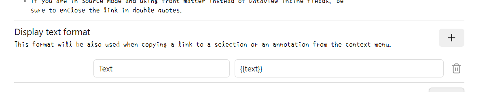
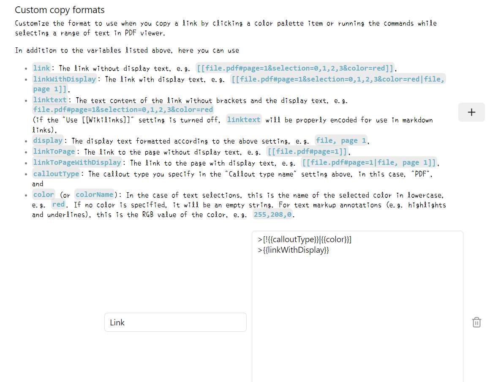

# WordCards for Obsidian

[english](../README.md)  [中文](./README-ZH.md)  日本語

**WordCards** は、Obsidian向けに設計されたプラグインで、詳細な単語カードを直接生成することで、語彙学習、語学学習、ノート記録の体験を向上させます。OpenAIのAPIとImgur APIを利用することで、WordCardsは包括的な単語エントリーを効率的に作成し、語彙量の管理と拡大を容易にします。

## 多言語サポート：学びたい任意の言語からパーソナライズされた語学学習カードを作成


## PDF++から単語カードを生成（双方向リンク）


## スクリーンショットからカードを生成（画像リンクを最後に追加）


## 機能特長

- **自動単語カード作成**：クリップボードのテキストや画像内容から詳細な単語カードを生成。
- **カスタマイズ可能なプロンプト**：ニーズに応じてカードテンプレートをカスタマイズ。
- **柔軟なオープンモード**：Obsidianワークスペース内の異なる位置（左側、右側、新しいウィンドウなど）で新規作成された単語カードを開く選択が可能。
- **画像サポート**：画像をImgurにアップロードし、単語カードに含めることが可能。
- **シームレスな統合**：ツールバーアイコンやコマンドを通じて、既存のObsidianワークフローに簡単に統合。
- **設定パネル**：言語、APIキー、フォルダパスなど、カードの動作を設定するための包括的な設定オプション。

## 目次

- [インストール](#インストール)
- [設定](#設定)
- [使い方](#使い方)
- [設定詳細](#設定詳細)
- [貢献](#貢献)
- [ライセンス](#ライセンス)

## インストール

### Obsidianコミュニティプラグインからインストール

1. **Obsidianを開く**。
2. `設定` > `コミュニティプラグイン` に移動。
3. `セキュリティモード` を**オフ**にする。
4. `ブラウズ`をクリックし、`WordCards`を検索。
5. `インストール`をクリックし、その後`有効化`をクリック。

### 手動インストール

1. **プラグインをダウンロード**：
   - [GitHub 仓库](https://github.com/bwicarus/Obsidian-WordCards.git)からクローンまたはダウンロード。
2. **プラグインフォルダをコピー**：
   - プラグインフォルダ (`WordCards`) をObsidian Vaultのプラグインディレクトリ：`.obsidian/plugins/` にコピー。
3. **Obsidianを再起動またはプラグインを再読み込み**。
4. **プラグインを有効化**：
   - `設定` > `コミュニティプラグイン` に移動し、`WordCards`を見つけて有効化。

## 設定

WordCardsを使用する前に、APIキーおよびその他の設定オプションを設定する必要があります。

### 必須のAPIキー

1. **OpenAI APIキー**：
   - [OpenAI](https://platform.openai.com/)に登録またはログイン。
   - APIセクションに移動し、新しいAPIキーを生成。
   - このキーを大切に保管し、公開しないでください。

2. **Imgur Client ID**：
   - [Imgur](https://api.imgur.com/oauth2/addclient)でアプリケーションを登録。
   - 適切なアプリタイプを選択し、`Client ID`を取得。

### 設定手順

1. **Obsidian設定を開く**：
   - `設定` > `プラグインオプション` > `WordCards` に移動。
2. **言語の設定**：
   - **ソース言語**：単語を入力する言語を選択（例：英語、日本語）。
   - **ターゲット言語**：単語カードの翻訳言語を選択（例：中国語、フランス語）。
3. **ターゲットフォルダパスを設定**：
   - 単語カードがVault内に保存される相対パスを指定（例：`Library/English/words`）。
4. **APIキーを入力**：
   - **OpenAI APIキー**：OpenAIのAPIキーを貼り付け。
   - **Client ID**：ImgurのClient IDを貼り付け。
5. **オープンモードを選択**：
   - 新規作成された単語カードをObsidianワークスペース内で開く位置を選択：
     - `left`：左側パネル。
     - `right`：右側パネル。
     - `window`：新しいウィンドウ。
     - `active`：アクティブパネル。
     - `tab`：新しいタブ。
     - `none`：自動で開かない。
6. **設定オプションを切り替える**：
   - **アクティブに設定**：カード作成後にそれをアクティブパネルにするか選択。
   - **カードの重複を許可**：新しいカードが既存のカードを上書きするか、新しいエントリーを作成するかを決定。
7. **プロンプトをカスタマイズ**：
   - GPTのプロンプト内容を変更し、単語カードに含まれる情報をカスタマイズ。

### その他の設定
PDF++と連携して美しいリンクを生成し、PDFにハイライトを表示したい場合は、以下のPDF++の設定を使用してください。



```
{{text}}
```



```
>[!{{calloutType}}|{{color}}]
>{{linkWithDisplay}}
```

## 使い方

### 単語カードの作成

#### ツールバーアイコンから

1. 文字列を選択するか、スクリーンショットを行う。
2. Obsidianのツールバーにある**WordCardsアイコン**をクリックし、クリップボードの内容から新しい単語カードを生成。

#### コマンドパネルから

1. 文字を選択するか、スクリーンショットを行う。
2. `Ctrl+P`（またはmacOSでは `Cmd+P`）を押してコマンドパネルを開く。
3. `Get clipboard content, query GPT, and create a new note`を検索し、実行。

#### Commanderプラグインを使用
[[插件链接]](https://github.com/phibr0/obsidian-commander)

このプラグインは、さまざまな場所でさまざまな方法でコマンドを使用でき、複数のコマンドを簡単に組み合わせることができます。

PDF++でワンクリックでカードを作成する設定も可能です（はい、私がそうするほど怠け者だからです）。


`add command`でPDF++のコピーリンクコマンドを追加し、短い遅延を挟んでからカードコマンドを追加します。

このコマンドを作成した後、Commanderプラグインを使って任意の場所に配置できます。

### ワークフローステージ

- **クリップボードにテキストが含まれている場合**：
  - クリップボードに単語テキストがある場合、WordCardsは設定されたプロンプトに基づいて、翻訳、定義、例文などの詳細情報を含む単語カードを作成します。

- **クリップボードに画像が含まれている場合**：
  - クリップボードに画像がある場合、WordCardsは画像をImgurにアップロードし、GPT-4を使用して画像内容を分析し、抽出情報と画像を含む単語カードを作成します。

- **アクティブファイルを処理**：
  - 現在のアクティブファイルの種類（MarkdownやPDFなど）に基づいて、WordCardsは内容を適切に処理し、新しい単語カードを作成するか、既存のカードに追加します。

## 設定詳細

`設定` > `プラグインオプション` > `WordCards` に移動することで、設定パネルにアクセスできます。以下は利用可能な設定の詳細な説明です：

- **ソース言語**：
  - ドロップダウンメニューから入力単語の言語を選択。

- **ターゲット言語**：
  - ドロップダウンメニューから単語カードの翻訳言語を選択。

- **単語ファイルのターゲットフォルダパス**：
  - テキスト入力欄に、Vault内に保存される単語カードの場所を指定（例：`Library/English/words`）。

- **OpenAI APIキー**：
  - テキスト入力欄にOpenAIのAPIキーを入力。

- **Client ID**：
  - テキスト入力欄にImgurのClient IDを入力。

- **オープンモード**：
  - ドロップダウンメニューから新しい単語カードの開く位置を選択（左側、右側、新しいウィンドウ、アクティブ、タブ、自動で開かない）。

- **アクティブに設定**：
  - トグルスイッチで、カード作成後にそれをアクティブパネルにするかどうかを決定（すなわち、ポップアップ表示するかどうか。いいえを選択すると折りたたまれてもポップアップ表示されません）。

- **カードの重複を許可**：
  - トグルスイッチで、新しいカードが既存のカードを上書きするか、新しいエントリーを作成するかを決定。

- **プロンプト**：
  - テキストエリアでGPTのプロンプト内容をカスタマイズし、単語カード生成時の情報を調整。

## 貢献

このプロジェクトは、私のJavaScriptの入門練習として始めたもので、多くの点で不足しています。皆さんの指摘を歓迎します。皆で交流し、使いやすいプラグインを作りたいと非常に思っています。質問、疑問、機能の提案があれば、[GitHub 问题页](https://github.com/bwicarus/Obsidian-WordCards/issues)にIssueを投稿してください。

## ライセンス

## 私について
私は日本に住む苦労する留学生（現在はアルバイトもしています）です。日本語はちょうど使えるレベルまで勉強しましたが、英語はやはり勉強し続ける必要があると感じています（英語が嫌いだから日本を選んだのにORZ）。仕事の合間に独学でプログラミングを学び、さまざまな小さなソフトウェアを開発しています（ほとんどはPythonです）。

私をサポートしたい場合は、コーヒーを一杯ご馳走してください。

[](https://ko-fi.com/linhao)

楽しんでご利用ください！