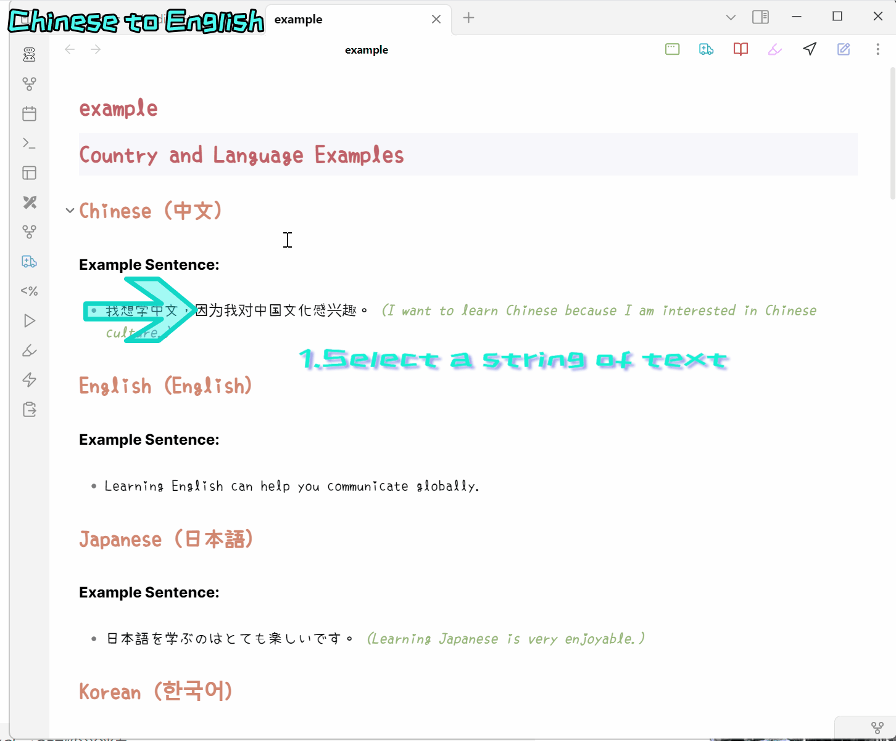
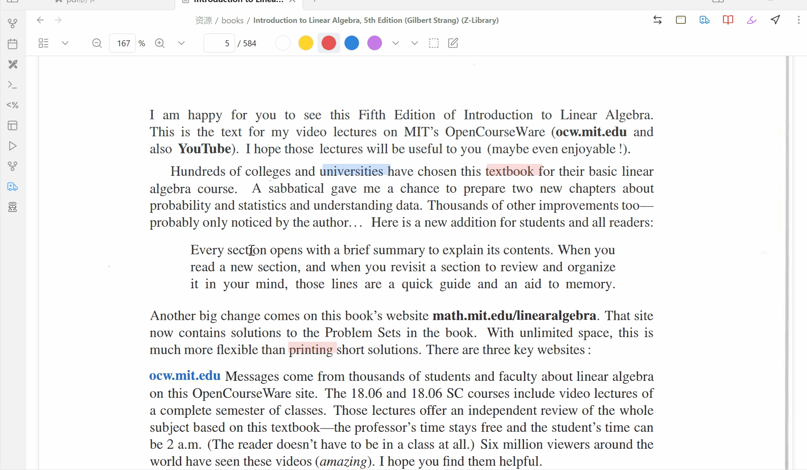
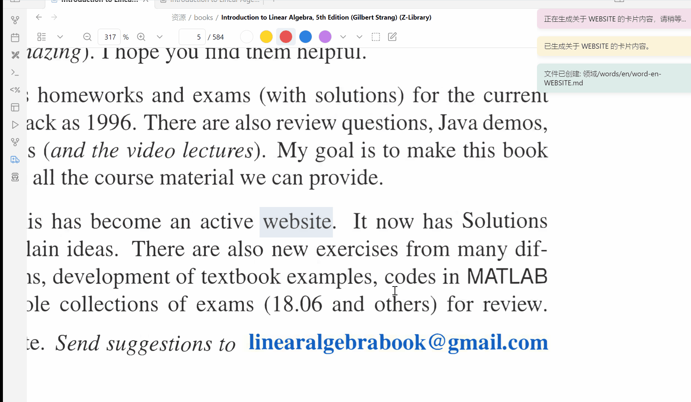
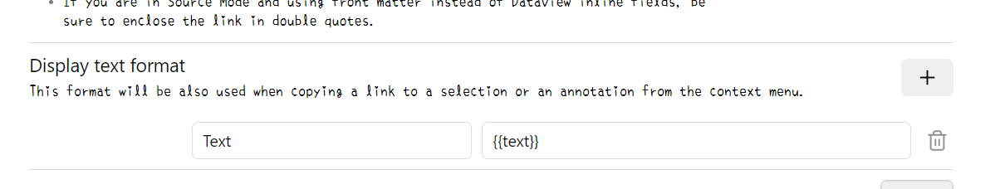
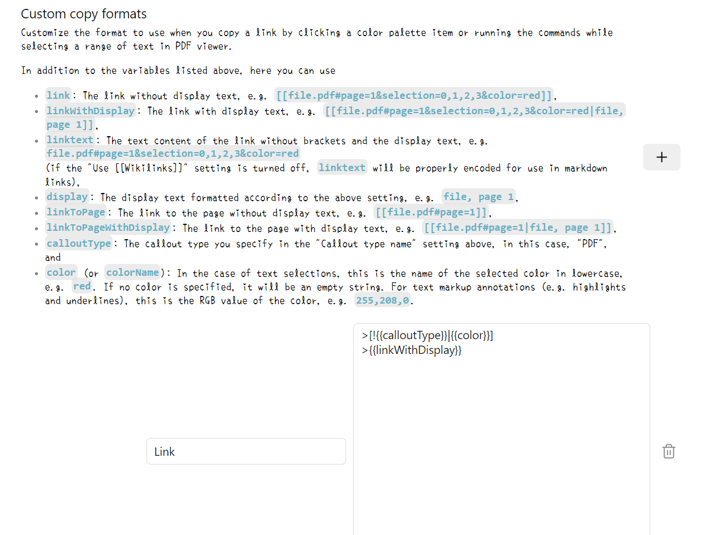
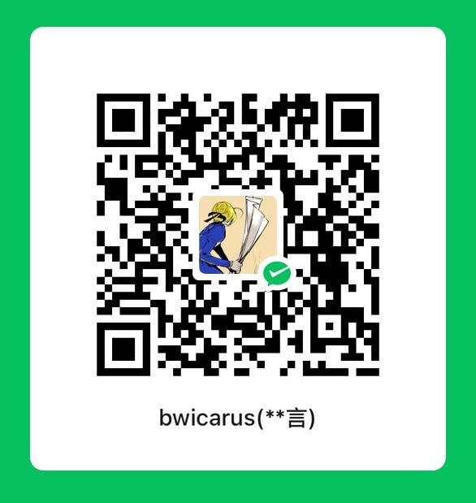

# WordCards  for Obsidian

[english](./README.md)  中文  [日本語](./README-JP.md)

**WordCards** 是一个为 Obsidian 设计的插件，旨在通过直接生成详细的单词卡片，提升您的词汇学习、语言学习和笔记记录体验。利用 OpenAI 的 API 和 Imgur API，WordCards 能够高效地创建全面的单词条目，助您轻松管理和扩展词汇量。

## 多语言支持：从您想学习的任何语言创建个性化的语言学习卡片。

## 从PDF++中生成单词卡(双向链接)

## 截屏生成卡片(添加图片链接在最后)



## 功能特性

- **自动创建单词卡片**：从剪贴板的文本或图片内容生成详细的单词卡片。
- **可定制的提示**：根据您的需求自定义卡片模板。
- **灵活的打开模式**：选择在 Obsidian 工作区中的不同位置打开新创建的单词卡片（左侧、右侧、新窗口等）。
- **图片支持**：上传图片至 Imgur 并将其包含在单词卡片中。
- **无缝集成**：通过工具栏图标和命令轻松集成到现有的 Obsidian 工作流程中。
- **设置面板**：全面的设置选项，用于配置语言、API 密钥、文件夹路径等,卡片行为.

## 目录

- [安装](#安装)
- [配置](#配置)
- [使用方法](#使用方法)
- [设置详情](#设置详情)
- [贡献](#贡献)
- [许可证](#许可证)

## 安装

### 通过 Obsidian 社区插件安装

1. **打开 Obsidian**。
2. 转到 `设置` > `社区插件`。
3. 确保 `安全模式` **已关闭**。
4. 点击 `浏览`，搜索 `WordCards`。
5. 点击 `安装`，然后点击 `启用`。

### 手动安装

1. **下载插件**：
   - 从 [GitHub 仓库](https://github.com/bwicarus/Obsidian-WordCards.git) 克隆或下载插件。
2. **复制插件文件夹**：
   - 将插件文件夹 (`WordCards`) 复制到您的 Obsidian Vault 的插件目录中：`.obsidian/plugins/`。
3. **重启 Obsidian 或重新加载插件**。
4. **启用插件**：
   - 转到 `设置` > `社区插件`，找到 `WordCards` 并启用它。

## 配置

在使用 WordCards 之前，您需要设置 API 密钥和其他配置选项。

### 必需的 API 密钥

1. **OpenAI API 密钥**：
   - 前往 [OpenAI](https://platform.openai.com/) 注册或登录。
   - 导航到 API 部分并生成一个新的 API 密钥。
   - 请妥善保管此密钥，避免公开分享。

2. **Imgur Client ID**：
   - 在 [Imgur](https://api.imgur.com/oauth2/addclient) 注册一个应用。
   - 选择合适的应用类型并获取您的 `Client ID`。

### 设置步骤

1. **打开 Obsidian 设置**：
   - 转到 `设置` > `插件选项` > `WordCards`。
2. **配置语言**：
   - **源语言**：选择您输入单词的语言（例如：英语、日语）。
   - **目标语言**：选择单词卡片的翻译语言（例如：中文、法语）。
3. **设置目标文件夹路径**：
   - 指定单词卡片将在您的 Vault 中保存的相对路径（例如：`Library/English/words`）。
4. **输入 API 密钥**：
   - **OpenAI API 密钥**：粘贴您的 OpenAI API 密钥。
   - **Client ID**：粘贴您的 Imgur Client ID。
5. **选择打开模式**：
   - 选择新创建的单词卡片在 Obsidian 工作区中的打开位置：
     - `left`：左侧面板。
     - `right`：右侧面板。
     - `window`：新窗口。
     - `active`：活动面板。
     - `tab`：新标签页。
     - `none`：不自动打开。
6. **切换设置选项**：
   - **设置为活动状态**：选择创建卡片后是否将其设为活动面板。
   - **允许重叠卡片**：决定是否允许新卡片覆盖已有卡片，或创建新条目。
7. **自定义提示**：
   - 修改 GPT 的提示内容，以自定义单词卡片中包含的信息。
### 其它设置
如果你想配合pdf++生成漂亮的链接并在pdf中显示高亮,请设置pdf++的以下部分使用


```

{{text}}

```

```

>[!{{calloutType}}|{{color}}]

>{{linkWithDisplay}}

```

## 使用方法

### 创建单词卡片

#### 通过工具栏图标

1. 选中字符串或者进行屏幕截图
1. 点击 Obsidian 工具栏中的 **WordCards 图标**，从剪贴板内容生成新的单词卡片。

#### 通过命令面板

1. 选中字符或者屏幕截图

2. 按 `Ctrl+P`（或 macOS 上的 `Cmd+P`）打开命令面板。

3. 搜索 `Get clipboard content, query GPT, and create a new note` 并执行该命令。

   
#### 使用 Commander插件
[[插件链接]](https://github.com/phibr0/obsidian-commander)
这个插件可以让你在各种地方以各种方式使用命令,甚至简单的组合各种命令

你甚至可以通过配置实现在pdf++中一键创建卡片(对,我就是这么懒)


add command添加pdf++的复制链接命令,然后加入一个短暂的delay然后加入我们的卡片命令

这个命令创建后你就可以用commander插件将它放在任何地方

### 工作流程场景

- **剪贴板包含文本**：
  - 如果剪贴板中有单词文本，激活 WordCards 将根据配置的提示创建包含翻译、定义、例句等详细信息的单词卡片。

- **剪贴板包含图片**：
  - 如果剪贴板中有图片，WordCards 将上传图片至 Imgur，使用 GPT-4 分析图片内容，并创建包含提取信息和图片的单词卡片。

- **处理活动文件**：
  - 根据当前活动文件的类型（例如 Markdown 或 PDF），WordCards 将相应地处理内容，创建新的单词卡片或追加到现有卡片中。

## 设置详情

您可以通过转到 `设置` > `插件选项` > `WordCards` 访问设置面板。以下是可用设置的详细说明：

- **源语言**：
  - 下拉菜单选择输入单词的语言。

- **目标语言**：
  - 下拉菜单选择单词卡片的翻译语言。

- **单词文件目标文件夹路径**：
  - 文本输入框，指定单词卡片在 Vault 中保存的位置（例如：`Library/English/words`）。

- **OpenAI API 密钥**：
  - 文本输入框，输入您的 OpenAI API 密钥。

- **Client ID**：
  - 文本输入框，输入您的 Imgur Client ID。

- **打开模式**：
  - 下拉菜单选择新单词卡片的打开位置（左侧、右侧、新窗口、活动、标签、不打开）。

- **设置为活动状态**：
  - 切换开关，决定创建卡片后是否将其设为活动面板(也就是是否跳出来,如果选否的话被折叠也不会弹出)。

- **允许重叠卡片**：
  - 切换开关，决定是否允许新卡片覆盖已有卡片或创建新条目。

- **Prompt**：
  - 文本区域，用于自定义 gpt 的提示内容，以调整单词卡片生成的信息。

## 贡献

因为这个项目是作为我的JavaScript的入门练习开始的,很多地方都有不足,欢迎大家指正,非常希望一起交流做出我们都方便使用的插件,如有任何问题、疑问或功能建议，请在 [GitHub 问题页](https://github.com/bwicarus/Obsidian-WordCards/issues) 上提交 Issue。

## 关于我
我只是一个住在日本的苦逼留学生(虽说暂时在上班),日语刚刚学习到刚刚够用的水平,却发现英语还是不得不继续学习(明明就是因为讨厌英语才选择了日本ORZ),上班之余自学编程开发了各种小软件(大多是python)

如果有想要交流的事情,欢迎发邮件给我,如果想通过微信交流请说明来意(obsidian插件的问题之类的)

邮箱:bwicarus@gmail.com

微信号:Mf12189115

当然如果你想支持我,可以请我一杯咖啡

[](https://ko-fi.com/linhao)


[](./wechat.jpeg)

祝您使用愉快！